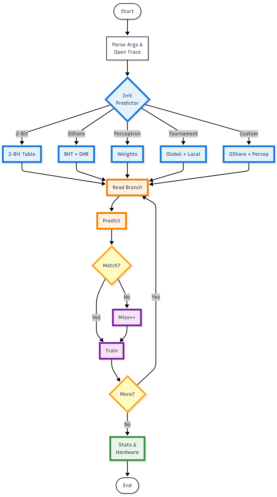
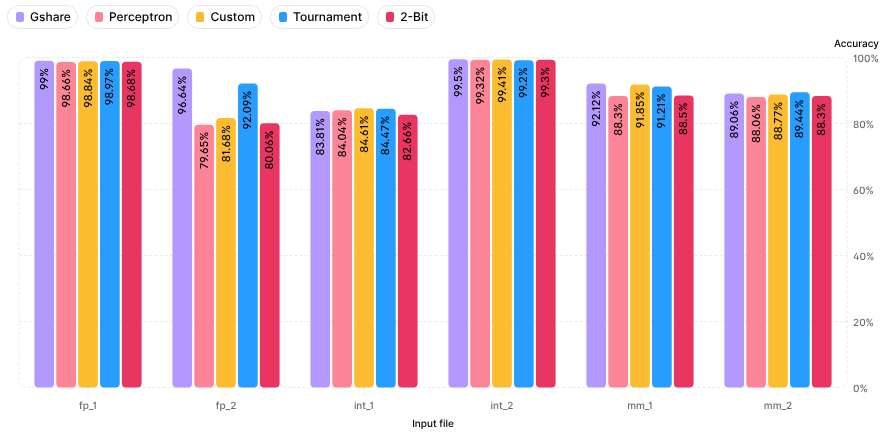
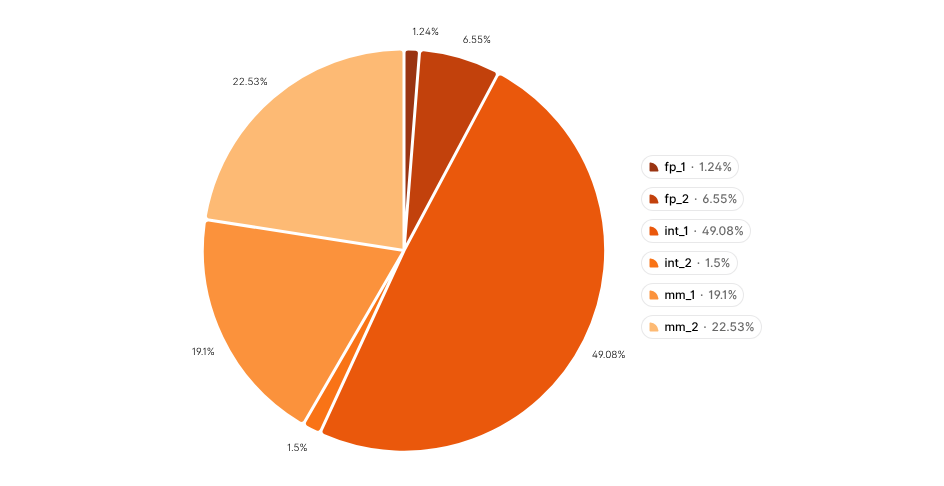
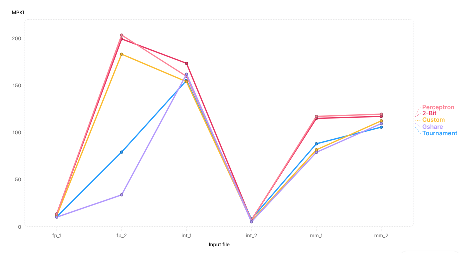

# Gshare_Perceptron_Predictor

## Overview
This project implements a hybrid branch predictor that combines a Gshare branch predictor and a Perceptron branch predictor.
The goal is to leverage the complementary strengths of both prediction strategies — Gshare’s simple, fast global-history based prediction,
and Perceptron’s ability to learn complex patterns using a linear classifier — to achieve improved overall branch prediction accuracy.

## Project Structure
```
├─ src/        # source code for predictors and simulation
├─ traces/     # sample branch traces or benchmark traces for testing
├─ README.md
├─ Makefile    # scripts for building and running simulations
```

## Implementation Flow
The simulation framework parses the trace, initializes the selected predictor, then iterates over every dynamic branch — predicting, comparing against the actual outcome, updating/training the predictor structures, and finally reporting statistics and hardware cost.



## Features
- Implementation of Gshare predictor (global history + PC-based indexing)
- Implementation of Perceptron predictor (history-based linear classifier)
- Hybrid predictor that chooses between Gshare and Perceptron using chooser table indexed by Gshare
- Support for configurable parameters, e.g.:
  - Global history length / size for Gshare
  - Number of perceptrons, history length, threshold values for Perceptron predictor
- Evaluation framework: ability to feed branch traces, simulate prediction, and compute misprediction rates / accuracy

## How to Build & Run
- `git clone https://github.com/your-username/Gshare_Perceptron_Predictor.git`
- `cd Gshare_Perceptron_Predictor/src`
- `make clean`
- `make`
- `./predictor_app ../traces/<input_file_name> --verbose` (for running all predictors)
- `./predictor_app ../traces/<input_file_name> --<options> --verbose`
- options = `--gshare`, `--perceptron`, `--custom`, `--tournament`, `--2bit`

## Configurable Parameters & Tuning

### Gshare
- Global history length (number of past branch outcomes to maintain)
- Size of the pattern history table (PHT)

### Perceptron
- Number of perceptrons / table size
- History length
- Weight representation
- Threshold for perceptron output to decide “taken” vs “not taken”

**NOTES:**
- Helps in reducing BTB failures.

### Hybrid selection mechanism
- The “chooser” table logic that selects which predictor to trust per branch based on indexing of gshare

The above perceptron accuracy is compared with Tournament and 2-Bit predictor for performance evaluation. The predictors are implemented in the same system.

## Results

We evaluated five branch predictors: Gshare, Perceptron, Custom Hybrid (Gshare+Perceptron), Tournament, and 2-bit counter across six traces.

### Accuracy Comparison (in %)

| Input | Gsh | Perc | Cust | Tour | 2Bit |
|-------|---------|---------|---------|---------|---------|
| fp1   | 99.0010 | 98.6618 | 98.8421 | 98.9675 | 98.6767 |
| fp2   | 96.6373 | 79.6521 | 81.6823 | 92.0923 | 80.0638 |
| int1  | 83.8089 | 84.0421 | 84.6140 | 84.4713 | 82.6594 |
| int2  | 99.5037 | 99.3165 | 99.4140 | 99.2009 | 99.3039 |
| mm1   | 92.1159 | 88.2970 | 91.8541 | 91.2064 | 88.5024 |
| mm2   | 89.0640 | 88.0614 | 88.7725 | 89.4393 | 88.2954 |



The results show that no single predictor dominates universally, but Gshare and the Custom predictor remain consistently strong across most workloads. In floating-point traces (fp1 and fp2), Gshare clearly outperforms Perceptron, while integer traces show closer performance among Gshare, Perceptron, and Custom. The Tournament predictor remains competitive but does not consistently achieve the highest accuracy. Predictor effectiveness is heavily workload-dependent, especially between floating-point and integer-dominated traces.

### Misprediction Counts

| Input | Gsh | Perc | Cust | Tour | 2Bit |
|-------|--------|--------|--------|--------|--------|
| fp1   | 15452  | 20700  | 17911  | 15970  | 20468  |
| fp2   | 81446  | 492835 | 443663 | 191528 | 482864 |
| int1  | 610680 | 601884 | 580314 | 585696 | 654036 |
| int2  | 18638  | 25666  | 22008  | 30010  | 26142  |
| mm1   | 237693 | 352829 | 245588 | 265114 | 346635 |
| mm2   | 280387 | 306094 | 287862 | 270765 | 300094 |



Lower values indicate better performance. Gshare again performs well in most cases, especially in fp1, fp2, and int2. The Perceptron predictor, although powerful in theory, shows significantly higher mispredictions in several workloads such as fp2, mm1, and mm2, indicating difficulty with certain branch patterns. The Custom predictor generally performs close to Gshare and often better than Perceptron.

### MPKI Comparison (Mispredictions Per Thousand Instructions)

| Input | Gsh | Perc | Cust | Tour | 2Bit |
|-------|------------|------------|------------|------------|------------|
| fp1   | 9.989675   | 13.382493  | 11.579412  | 10.324500  | 13.232506  |
| fp2   | 33.626900  | 203.478542 | 183.176724 | 79.076848  | 199.361780 |
| int1  | 161.911203 | 159.579097 | 153.860185 | 155.287130 | 173.406294 |
| int2  | 4.963099   | 6.834580   | 5.860494   | 7.991340   | 6.961333   |
| mm1   | 78.840738  | 117.030366 | 81.459442  | 87.936050  | 114.975869 |
| mm2   | 109.359697 | 119.386231 | 112.275181 | 105.606816 | 117.046044 |



The MPKI results closely mirror the misprediction trends: Gshare tends to provide the lowest MPKI for most traces, especially in fp1 and fp2. Perceptron shows very high MPKI in floating-point workloads, indicating poor generalization on those patterns. The Custom predictor remains competitive and often reduces MPKI noticeably compared to Perceptron. Tournament performs moderately well but does not surpass Gshare in most cases. Predictor complexity does not always translate into practical performance gains.

### Selector (Chooser) Distribution (in %)

| Input file | Gshare chosen | Perceptron chosen |
|------------|---------------|-------------------|
| fp1        | 3.77          | 96.23             |
| fp2        | 41.59         | 58.41             |
| int1       | 27.72         | 72.28             |
| int2       | 4.07          | 95.93             |
| mm1        | 52.04         | 47.96             |
| mm2        | 31.52         | 68.48             |

This table shows how often the hybrid design selected Gshare or Perceptron. In most traces, the chooser favors Perceptron, suggesting it is identified as more accurate over time. However, in workloads such as mm1 and fp2, Gshare is selected more frequently, aligning with the earlier tables where Gshare outperformed Perceptron. This confirms that the hybrid predictor adapts to workload behavior — relying on Perceptron when its learning strengths are beneficial, and switching to Gshare when simpler correlation-based prediction performs better.

## Summary
Branch predictor performance varies significantly across workloads, and no single predictor dominates universally. Gshare performs well on traces with strong short-range global correlations, while Perceptron excels on irregular integer workloads but suffers large performance drops on certain floating-point traces. The Tournament and Custom Hybrid predictors provide the most stable behavior, maintaining low MPKI and avoiding the extreme accuracy losses seen in individual predictors. Overall, hybrid and tournament predictors offer the best balance of accuracy, robustness, and performance across diverse workloads, while simple 2-bit predictors are inadequate for modern branch patterns.
